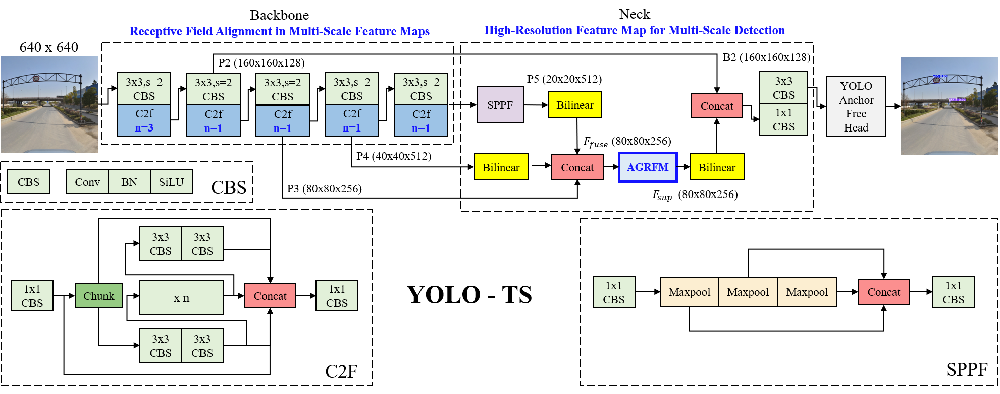

# YOLO-TS: Real-Time Traffic Sign Detection with Enhanced Accuracy Using Optimized Receptive Fields and Anchor-Free Fusion (IEEE TITS submitted)

 Junzhou Chen, Heqiang Huang, Ronghui Zhang, Nengchao Lyu, Yanyong Guo, Hong-Ning Dai, Hong Yan

[Paper Download](https://arxiv.org/pdf/2410.17144v1)

> **Abstract:** *Ensuring safety in both autonomous driving and advanced driver-assistance systems (ADAS) depends critically on the efficient deployment of traffic sign recognition technology. While current methods show effectiveness, they often compromise between speed and accuracy. To address this issue, we present a novel real-time and efficient road sign detection network, YOLO-TS. This network significantly improves performance by optimizing the receptive fields of multi-scale feature maps to align more closely with the size distribution of traffic signs in various datasets. Moreover, our innovative feature-fusion strategy, leveraging the flexibility of Anchor-Free methods, allows for multi-scale object detection on a high-resolution feature map abundant in contextual information, achieving remarkable enhancements in both accuracy and speed. To mitigate the adverse effects of the grid pattern caused by dilated convolutions on the detection of smaller objects, we have devised a unique module that not only mitigates this grid effect but also widens the receptive field to encompass an extensive range of spatial contextual information, thus boosting the efficiency of information usage. Furthermore, to address the scarcity of traffic sign datasets in adverse weather conditions, we have generated an anomaly-based road sign detection dataset, the Generated-TT100K-weather dataset, based on the TT100K dataset. Evaluation on challenging public datasets, TT100K, CCTSDB2021, as well as our generated Generated-TT100K-weather dataset, demonstrates that YOLO-TS surpasses existing state-of-the-art methods in terms of both accuracy and speed.*

## Method

Application Scenarios of Traffic Sign Detection in Autonomous Driving.


**YOLO-TS architecture.** The structure of YOLO-TS.

## Datasets
* The download link for the dataset is below:
<table>
<thead>
  <tr>
    <th>Datsets</th>
    <th>TT100K</th>
    <th>CCTSDB2021</th>
    <th>Generated-TT100K-weather</th>
  </tr>
</thead>
<tbody>
  <tr>
    <td>Download</td>
    <td> <a href="https://pan.baidu.com/s/1TEzyt8w2C2z06hj2M-yNsg?pwd=4wz8 ">Download </a> </td>
    <td> <a href="https://github.com/jefferson2021ufc/EdgeFireSmoke?tab=readme-ov-file">Download </a> </td>
    <td> <a href="https://github.com/jefferson2021ufc/EdgeFireSmoke?tab=readme-ov-file">Download </a> </td>
  </tr>
</tbody>
</table>

* The file structure of the downloaded dataset is as follows.
* Please note that the `detection` folder within the CDSD dataset contains bounding box labels, which can be used for comparison with object detection methods.

```
datasets
├── TT100K
│   ├── train
│   └── test
├── CCTSDB2021
│   ├── train
│   ├── val
│   └── Classification based on weather and environment
│       ├── cloud
│       ├── foggy
│       ├── cloud
│       ├── night
│       ├── rain
│       ├── snow
│       ├── sunny
├── Generated-TT100K-weather
    ├── train
    ├── test
    └── Classification based on weather and environment
        ├── night-test
        ├── rain-test
```

## Requirements
* To install requirements: 
```
pip install -r requirements.txt
```

## Training
### Python

YOLO may also be used directly in a Python environment, and accepts the same [arguments](https://docs.ultralytics.com/usage/cfg/) as in the CLI example above:

```python
from ultralytics import YOLO

if __name__ == '__main__':

    # Load a model
    model = YOLO("./best.pt")

    # Train the model
    model.train(data="./TT100K-2016.yaml", epochs=200, batch=48, imgsz=640, device='0,1,2,3')

    # Evaluate model performance on the validation set
    metrics = model.val(data="./TT100K-2016.yaml", imgsz=640, batch=1, device='0')

    # Export the model to ONNX format
    path = model.export(format="engine", device='0', half=True, opset=12)
```

See YOLO [Python Docs](https://docs.ultralytics.com/usage/python/) for more examples.

## Experiment result


## Pre-trained Models
The trained weight files for different datasets are listed below, including both `.pth` and `.trt` formats.

<table>
<thead>
  <tr>
    <th>Weights</th>
    <th>ckpt</th>
    <th>tensorrt</th>
  </tr>
</thead>
<tbody>
  <tr>
    <td>Baidu Cloud</td>
    <td> <a href="https://pan.baidu.com/s/1728RkFAG8tYlpF5OkoGc0A?pwd=b32l ">Download </a> </td>
    <td> <a href="https://pan.baidu.com/s/1kuYaKuQSgCHmTxgcrthM7w?pwd=1nqm ">Download </a> </td>
  </tr>
</tbody>
</table>

## Citation
If you use YOLO-TS, please consider citing:
```
@article{chen2024yolo,
  title={YOLO-TS: Real-Time Traffic Sign Detection with Enhanced Accuracy Using Optimized Receptive Fields and Anchor-Free Fusion},
  author={Chen, Junzhou and Huang, Heqiang and Zhang, Ronghui and Lyu, Nengchao and Guo, Yanyong and Dai, Hong-Ning and Yan, Hong},
  journal={arXiv preprint arXiv:2410.17144},
  year={2024}
}
```

## Contact
Should you have any question or suggestion, please contact huanghq77@mail2.sysu.edu.cn
